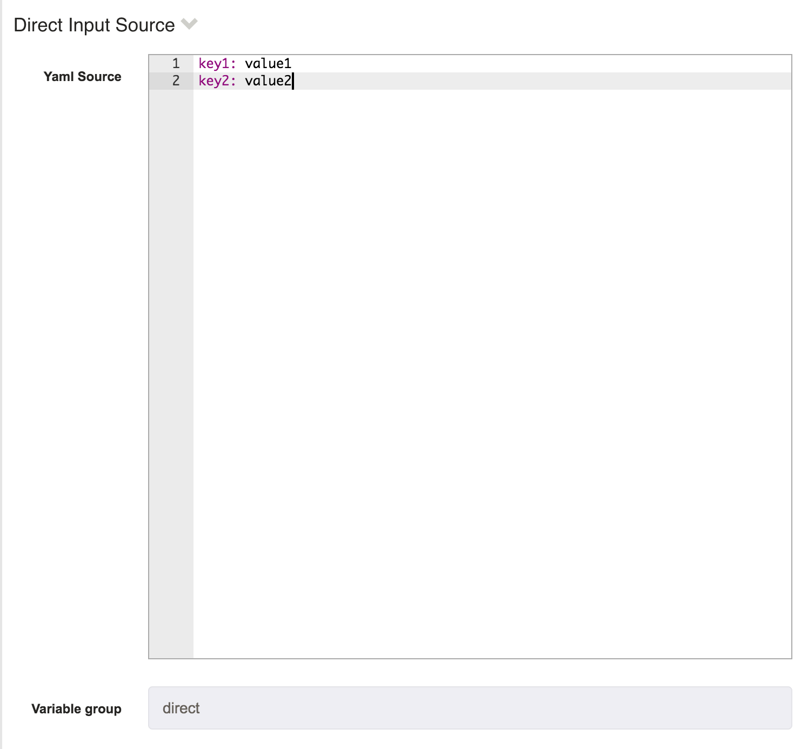

# Set Job Globals Rundeck Plugin

## Set Job Globals

This is a Rundeck workflow step plugin that reads yaml data from one of the following sources:

* Rundeck Key Store
* Yaml file on the filesystem
* User supplied yaml

and puts the entries in the global context for subsequent steps to use.

For example:

If you save the following yaml text:

```
key1: value1
key2: value2
```

as a Direct Input Source, using `direct` as the Variable Group

you will have the global variables:
`direct.key1` and `direct.key2` available for use in your subsequent steps.

 

#### Key Store Access

You can specify paths in the keystore to be substituted in for your keys. 
For Example:

```
key1: value1
key2: ${KS:keys/subfolder/securevalue}
```

When the plugin runs, the key store value at the path `keys/subfolder/securevalue` will be used as the value for `key2`

## Auto Set Globals From KeyStore

A workflow step plugin that will read a yaml data structure saved in your KeyStore into global variables to be used in your workflow.

In your KeyStore save a yaml key/value structured data set.
In your project configuration set the property:
`project.plugin.WorkflowStep.autoset-globals.yamlSource` to the path in your keystore where the yaml file is saved
`project.plugin.WorkflowStep.autoset-globals.group` the name of the export group the yaml keys are exported under

##### Example

Save the following yaml at `keys/test`
```
key1: value1
key2: value2
```

Set the project properties in your project:
`project.plugin.WorkflowStep.autoset-globals.yamlSource=keys/test`
`project.plugin.WorkflowStep.autoset-globals.group=auto`

Create a Job with the AutoSetGlobalsFromKeyStore plugin as the first step
then configure a Log Data step

You will see two global variables in the the `auto` group.
`auto.key1=value1`
`auto.key2=value2`


